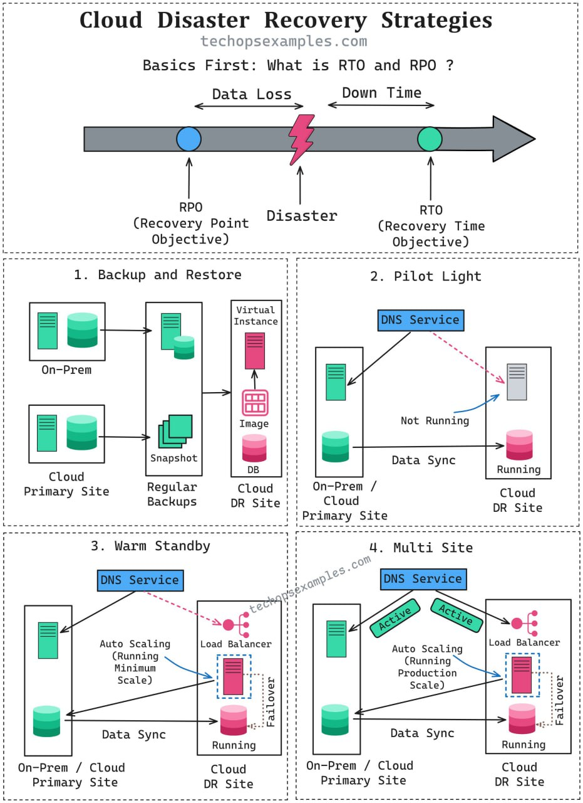

Любая стратегия Disaster Recovery начинается с определения:

🔹RTO (Recovery Time Objective) —
сколько простоя вы можете себе позволить?

🔹RPO (Recovery Point Objective) —
какую потерю данных вы готовы терпеть?

Стратегии Disaster Recovery:

1. Backup and Restore → регулярные бэкапы и восстановление после инцидента
RTO: от нескольких часов до нескольких дней, RPO: момент последнего бэкапа

2. Pilot Light → ядро системы находится в standby и разворачивается при необходимости
RTO: от минут до часов, RPO: зависит от частоты репликации

3. Warm Standby → укороченная «живая» копия среды, которую можно быстро расшscaleить
RTO: минуты, RPO: от нескольких минут до часов

4. Hot / Multi-Site → оба сайта работают активно с мгновенным фейловером
RTO: близок к нулю, RPO: секунды