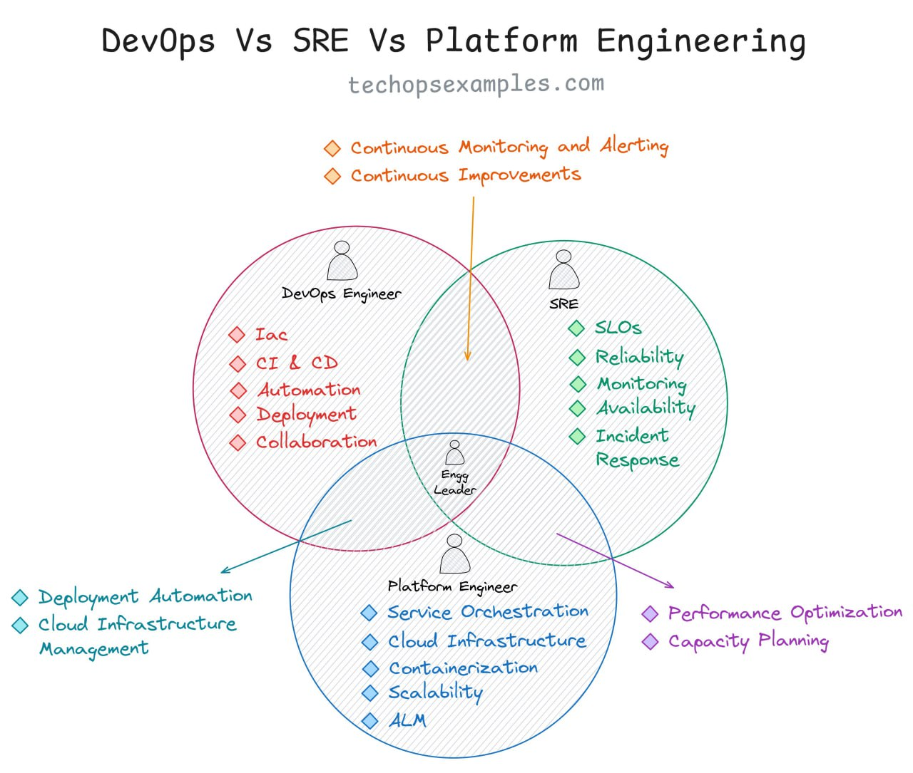

DevOps Engineers обеспечивают эффективную и надёжную доставку ПО, сокращая разрыв между командами разработки и операций.

Site Reliability Engineers (SRE) концентрируются на оптимизации надёжности, производительности и эффективности программных систем.

Platform Engineers проектируют, создают и поддерживают инфраструктуру и инструменты для поддержки разработки, деплоя и эксплуатации ПО.