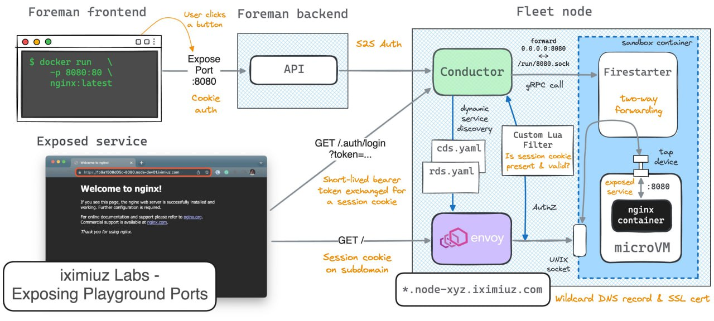

Как HTTP(S)-порты пробрасываются из VM, у которых есть только приватные IP-адреса

- У каждого bare-metal хоста есть только один публичный IP-адрес

- DNS-запись *.node-xyz.iximiuz.com и wildcard-сертификат Let’s Encrypt указывают на этот IP

- Каждый раз, когда наружу пробрасывается порт VM, генерируется новый случайный поддомен

- Этот рандомный поддомен не существует за пределами конкретного хоста, он известен только соответствующему bare-metal серверу

- Все запросы к этому поддомену приходят на единственный публичный IP хоста, где слушает ingress-прокси (Envoy)
  (https://t.me/loose_code) 
-Интерфейс VM виден только внутри её «обёртки» — Docker-контейнера (для дополнительной изоляции), поэтому Envoy не может достучаться до VM напрямую

- Вместо этого Envoy прокидывает запросы к поддомену в локальный UNIX-сокет, смонтированный в контейнер-обёртку VM

- Этот UNIX-сокет открыт специальным процессом-forwarder’ом (крошечный Go-сервис), который работает внутри контейнера-обёртки

- Forwarder делает io.Copy(UNIX socket, VM's private IP:port)

Профит! Десятки полностью изолированных VM на одном bare-metal хосте, и у каждой свой публичный URL