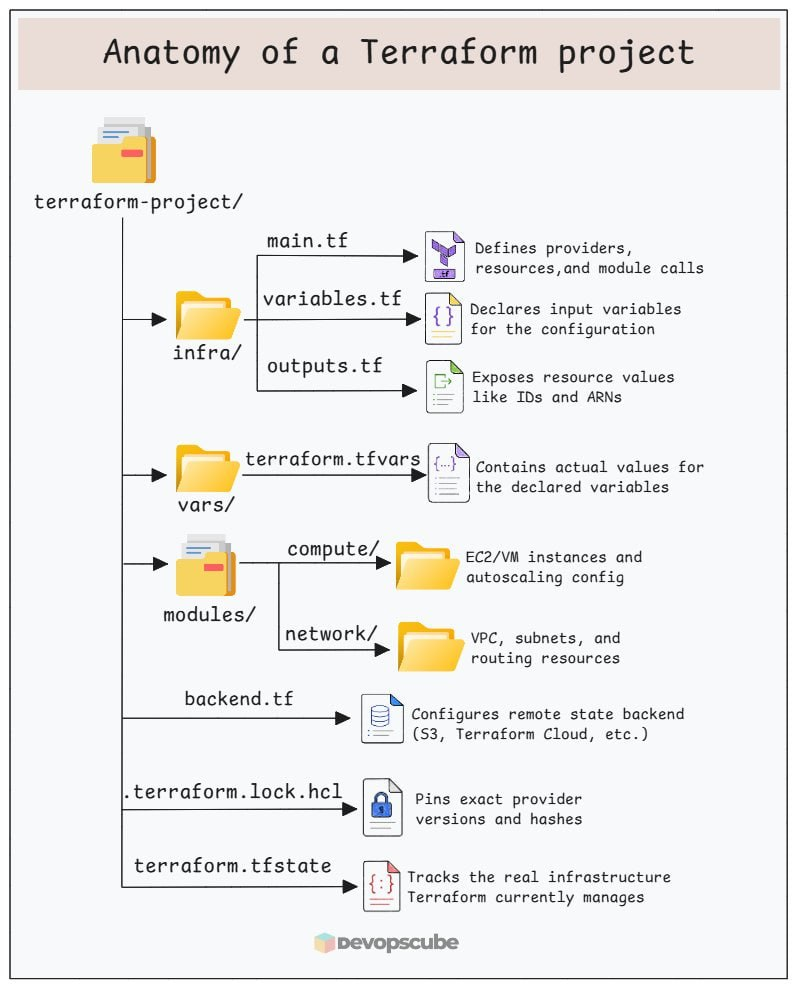

Вот основные файлы Terraform, с которыми стоит разобраться:
- main.tf: описывает ресурсы и вызовы модулей.
- variables.tf: объявляет входные переменные конфигурации.
- outputs.tf: экспортирует значения ресурсов, например ID и ARN.
- terraform.tfvars: задаёт конкретные значения для объявленных переменных.
- backend.tf: настраивает удалённый бэкенд для хранения state, например S3 или Terraform Cloud.
- modules/: директория с переиспользуемыми компонентами, например сетью и вычислительными ресурсами.
- terraform.lock.hcl: фиксирует выбранные версии провайдеров и их контрольные суммы.
- terraform.tfstate: хранит информацию о ресурсах, которыми управляет Terraform, и их текущем состоянии.

Когда понимаешь структуру проекта, ревью изменений и отладка вывода terraform plan становятся намного проще.

Поэтому, когда подключаетесь к новому проекту или разбираете чужой Terraform-код, сначала изучите структуру, а уже потом запускайте apply.